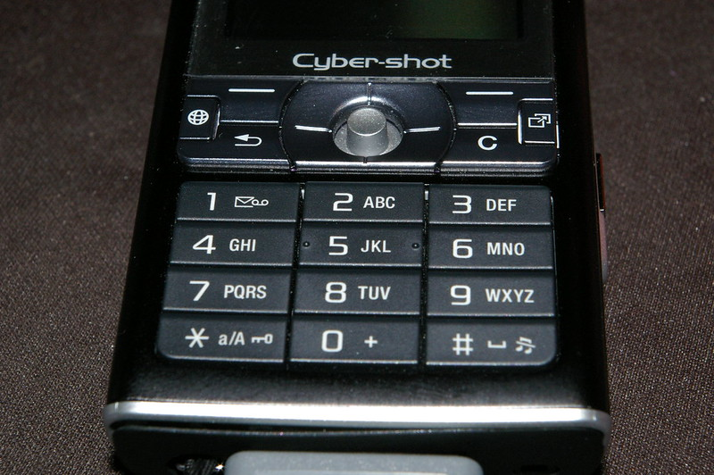

# Predictive T9

## Context
Remember those old cell phones that didn't have a full QWERTY keyboard? It took forever to type out a text message because you had to type the `7` key four times just to type the letter `S`.

The T9 algorithm was invented to make texting on a numeric keypad easier: it allows you to type any letter with a single keypress.

For example, to write `the`, you would type `843` (since `T` is on the `8` key, `H` is on the `4` key, and `E` is on the `3` key). T9 would then produce a list of words that match the sequence of keys you typed (`the`, `tie`, `vie`, etc.), and then you chose the word you meant to write.

## Problem Statement
Given a sequence of numbers typed on a mobile phone, produce a list of matching words, **ordered by popularity**. Interpret the sequence using the T9 algorithm--that is, assuming one keystroke per letter.

Determine the popularity of a word with the data in [wikipedia-word-frequencies.csv](../../../../resources/wikipedia-word-frequencies.csv). The CSV maps words to their frequency in a sample of Wikipedia content. For example, `the` appeared 101716 times in the content, and `of` appeared 43437 times. Those are the topmost entries in the file:

```
the,101716
of,43437
```

## Examples


Input: `4`  
Output: `["i","g","h"]`  
Explanation: all of these letters can be typed with the `4` key, and all are present in the dataset. The output is ordered by frequency: `i` is the most popular in the dataset (frequency = 722), followed by `g` (frequency = 44), then `h` (frequency = 39).

Input: `3333`  
Output: `["feed","deed"]`  
Explanation: These are the only four-letter words in the dataset composed of `d`, `e`, and `f`. `feed` (frequency = 58) is more popular than `deed` (frequency = 5), so it comes first.

Input: `5555`  
Output: `[]`  
Explanation: There are no four-letter words composed of `j`, `k`, and `l`.

Input: `2665`  
Output: `["book","cool","cook","bool"]`  

Input: `66657`  
Output: `["monks", "monk's"]`  
Explanation: The dataset contains words with apostrophes. These should be included in the output.

Input: `9282462537`  
Output: `["watchmaker"]`

## Thought experiment: autocomplete
How could you adapt your solution to return words that have the input numbers as a *prefix*? For example, if the user types `3333`, the solution would additionally check for 5+ letter words that start with `3333`, such as `feeds` and `deeds`.

## Attribution  
- The dataset of frequently used words is derived from the Wortschatz Leipzig dataset of word frequencies in Wikipedia articles (see: https://www.wortschatz.uni-leipzig.de/en/download/eng, Wikipedia 2021 100K dataset). I cleaned the data by:
    1. Excluding words containing whitespace, numbers, and special characters other than `'`
    2. Converting the words to lowercase
    3. Merging duplicate entries (e.g., the same word but with different capitalization)

- Cell phone image was created by 
Fred Taylor-Young and retrieved from [Flickr](https://flickr.com/photos/fr3d/237968460) ([CC BY-NC-SA 2.0](https://creativecommons.org/licenses/by-nc-sa/2.0/deed.en))